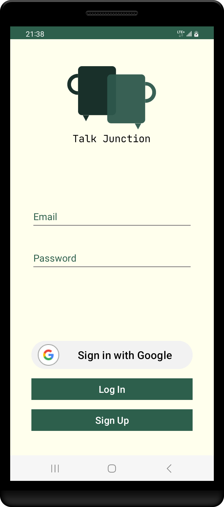
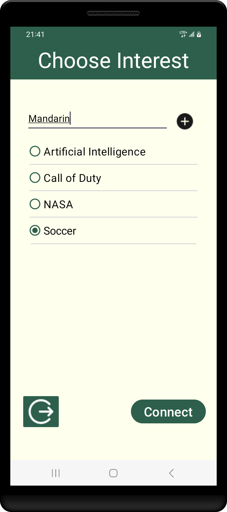
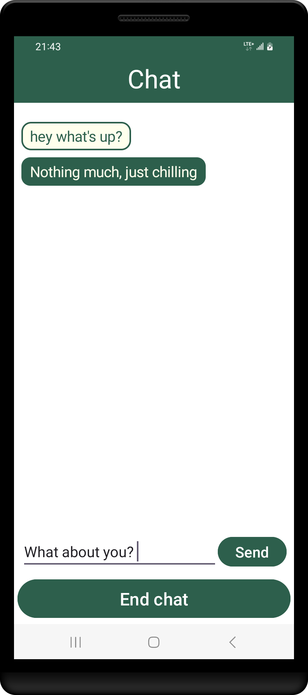

# TalkJunction

## Description

TalkJunction is an anonymous chat application designed to connect users based on shared interests. With TalkJunction, users can engage in conversations with others without revealing their identities. The app focuses solely on messaging, allowing users to exchange messages with their matched chat partner. If users no longer wish to continue the conversation, they have the option to end the chat at any time.

## Key Features

1. Anonymous Chatting: Users can chat with others anonymously, without disclosing their identities.
   
2. Interest-Based Matching: TalkJunction matches users based on shared interests, ensuring more meaningful conversations.
   
3. Message Exchange: The app allows users to exchange messages with their matched chat partners.
   
4. Chat Termination: Users have the option to end the chat if they wish to discontinue the conversation.

## How it Works

1. Registration: Users sign up for TalkJunction using their email address.

2. Interest Selection: Upon registration, users select their interests from a list provided by the app.

3. Matching: The app matches users with others who share similar interests.

4. Chatting: Once matched, users can engage in anonymous conversations with their chat partners.

5. End Chat: Users have the option to end the chat at any time if they feel like it.

## Images
##### Users can signup/login using email and gmail

 

##### Users can add new interests

 

##### User can end chat anytime

 

### Chat Interface:

In the chat interface:
- Text with a green background represents messages sent by you (the user).
- Text with a yellow color represents messages sent by the person you're chatting with.

## Technologies Used

- Firebase: TalkJunction utilizes Firebase Authentication for user authentication and Firebase Realtime Database for storing user data and chat messages.
  
- Android SDK: The app is developed using the Android Software Development Kit (SDK) for building native Android applications.

## Installation

1. Clone the TalkJunction repository from GitHub.
git clone https://github.com/Singh-Jas-meet/TalkJunction.git

2. Open the project in Android Studio.

3. Run the app on an Android device or emulator.

## Contributing

Contributions to TalkJunction are welcome! If you would like to contribute to the project, please follow these steps:

1. Fork the repository on GitHub.

2. Create a new branch for your feature or bug fix.

3. Make your changes and commit them to your branch.

4. Push your changes to your fork.

5. Submit a pull request to the main repository.

## Contact

For any inquiries or support regarding TalkJunction, please contact jasmeetsngh2002@gmail.com

Enjoy chatting anonymously with TalkJunction!
